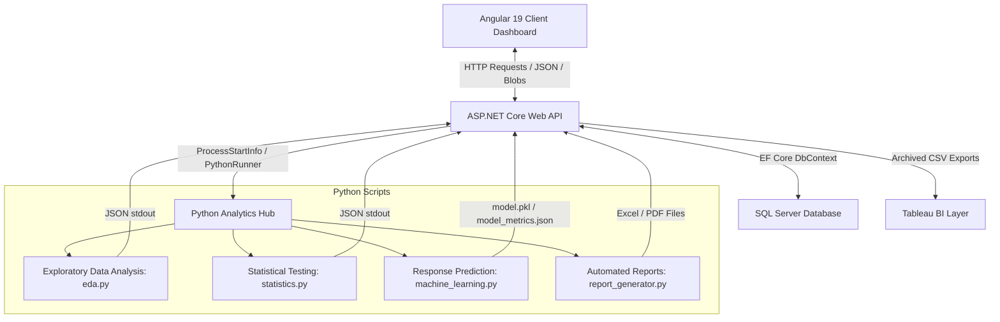

# Application Architecture Documentation

This document describes the high-level system architecture and structural flow of the Marketing Campaign Analytics Platform.

---

## Architecture Flow Diagram

---

## Layer Roles & Responsibilities

### 1. Presentation Layer (Angular 19 Client)
- **Framework**: Standalone components, Bootstrap 5, Chart.js.
- **Role**: Provides the client interface for executive dashboarding, campaign comparison, customer demographic charts, ML response prediction forms, report archives, and Tableau dataset exports.
- **Performance**: Prevents duplicate HTTP requests through client-side state caching, implements responsive grids, and handles empty database states gracefully.

### 2. Service & Business Logic Layer (ASP.NET Core 8 Web API)
- **Role**: Serves RESTful endpoints, coordinates transaction actions, and enforces business logic rules (such as RFM segmentation and persona mapping).
- **Python Runner**: Spawns Python subprocesses asynchronously using `ProcessStartInfo` to trigger numerical calculations, training, and report formatting.
- **Exception Handling**: Implements a global error-handling middleware that intercepts unhandled faults and translates them into clean API responses.

### 3. Data Storage Layer (SQL Server LocalDB & EF Core)
- **Role**: Relational data storage utilizing Entity Framework Core to map entities (`Customer`, `Campaign`, `CampaignResponse`) using code-first migrations.
- **Optimization**: Implements indexes and clean queries to prevent N+1 queries.

### 4. Computational Analytics Layer (Python Hub)
- **Role**: Houses scripts for statistical analysis, machine learning model fitting, and document layout rendering.
- **Exploratory Data Analysis (`eda.py`)**: Profiles dataset columns, outlier proportions, and Pearson correlations.
- **Statistical Testing (`statistics.py`)**: Computes WELCH's T-test, Chi-Square contingency metrics, and ordinary least squares (OLS) linear regressions.
- **Machine Learning (`machine_learning.py`)**: Implements scikit-learn Logistic Regression pipelines (standard scalers, one-hot encoders), joblib model caching, and classification performance reports.
- **Report Automation (`report_generator.py`)**: Converts raw data aggregates into styled worksheets with native charts (Excel via `openpyxl`) and paginated documents (PDF via `reportlab`).

### 5. Business Intelligence Layer (Tableau Integration)
- **Role**: Archiving Tableau-ready star-schema CSV tables to allow seamless dashboard building.
