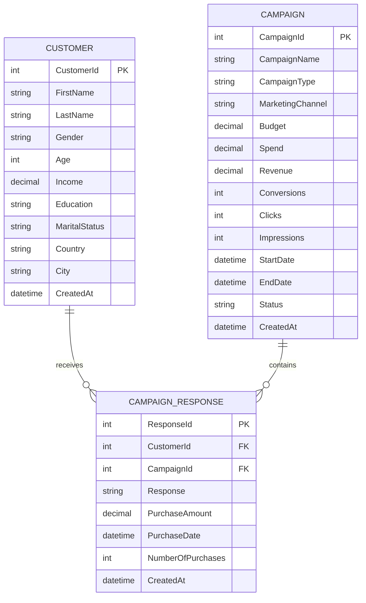

# Database Design Documentation

This document describes the schema structure, data types, indexes, and entity relationships of the SQL Server database.

---

## Entity Relationship Diagram (ERD)

---

## Relational Tables Schema

### 1. `Customers` Table
Stores customer demographic attributes.

| Column Name | Data Type | Constraints | Description |
| :--- | :--- | :--- | :--- |
| `CustomerId` | `int` | Primary Key, Identity | Unique customer ID |
| `FirstName` | `nvarchar(50)` | Required | Customer first name |
| `LastName` | `nvarchar(50)` | Required | Customer last name |
| `Gender` | `nvarchar(10)` | Required | Gender ("Male", "Female") |
| `Age` | `int` | Range(18-120) | Customer age |
| `Income` | `decimal(18,2)` | Required | Annual income |
| `Education` | `nvarchar(50)` | Required | Education level |
| `MaritalStatus` | `nvarchar(50)` | Required | Marital status |
| `Country` | `nvarchar(50)` | Required | Geographical country |
| `City` | `nvarchar(50)` | Required | Residence city |
| `CreatedAt` | `datetime2` | Required | Generation timestamp |

### 2. `Campaigns` Table
Stores campaign parameters and operational stats.

| Column Name | Data Type | Constraints | Description |
| :--- | :--- | :--- | :--- |
| `CampaignId` | `int` | Primary Key, Identity | Unique campaign ID |
| `CampaignName` | `nvarchar(100)` | Required | Campaign name |
| `CampaignType` | `nvarchar(50)` | Required | Campaign type (Acquisition, Retention, Loyalty) |
| `MarketingChannel` | `nvarchar(50)` | Required | Outreach channel (Email, SMS, Social Media, etc.) |
| `Budget` | `decimal(18,2)` | Required | Budget allocation |
| `Spend` | `decimal(18,2)` | Required | Actual marketing spend |
| `Revenue` | `decimal(18,2)` | Required | Revenue generated |
| `Conversions` | `int` | Required | Sales conversion count |
| `Clicks` | `int` | Required | Campaign click count |
| `Impressions` | `int` | Required | Audience impression count |
| `StartDate` | `datetime2` | Required | Start date |
| `EndDate` | `datetime2` | Required | End date |
| `Status` | `nvarchar(20)` | Required | Status ("Active", "Completed", "Paused") |
| `CreatedAt` | `datetime2` | Required | Generation timestamp |

### 3. `CampaignResponses` Table
Junction table tracking touchpoint records.

| Column Name | Data Type | Constraints | Description |
| :--- | :--- | :--- | :--- |
| `ResponseId` | `int` | Primary Key, Identity | Unique response ID |
| `CustomerId` | `int` | Foreign Key (Customers) | Customer reference |
| `CampaignId` | `int` | Foreign Key (Campaigns) | Campaign reference |
| `Response` | `nvarchar(10)` | Required | Response verdict ("Yes", "No") |
| `PurchaseAmount` | `decimal(18,2)` | Required | Purchases spend amount |
| `PurchaseDate` | `datetime2` | Required | Touchpoint sale date |
| `NumberOfPurchases` | `int` | Required | Number of items purchased |
| `CreatedAt` | `datetime2` | Required | Generation timestamp |

---

## Database Indexes

To optimize query operations during aggregations, the following indexes are configured:
- **Foreign Key Indexes**:
  - Index on `CampaignResponses.CustomerId` (Supports user history lookups).
  - Index on `CampaignResponses.CampaignId` (Supports campaign conversion rates).
- **Cluster Key Indexes**:
  - Automatically configured on Primary Keys (`CustomerId`, `CampaignId`, `ResponseId`).
